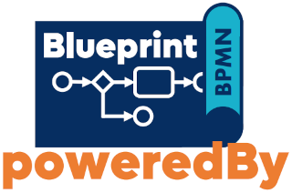

# Smallest possible Blueprint sample

This is a code-sample which shows how the [BPMN Blueprint SPI](https://github.com/stephanpelikan/bp-blueprint) simplifies building business processing applications. The Blueprint is used to implement a reduced taxi ride process.

Additionally, it highlights the differences to the [former approach](https://github.com/phactum-at/variable-less) presented at the talk *"How to Say Goodbye to Process Variables"* which was part of the [Camunda-Summit 2022](https://summit.camunda.com/expert-sessions/).

## Improvements

Using aspect oriented programming (AOP) design of the SPI...

1. ...prevents domination of business code by the SPI.
1. ...hides the BPMS (e.g. for easy upgrades from Camunda 7 to Camunda 8).
1. ...keeps the business-code readable and maintainable.
1. ...correct BPMN wiring can be validated at startup of the application.

## TaxiRide example

To see all this stuff in action have a look into the taxi ride integration test:

* BPMN:
  [src/main/resources/processes/TaxiRide.bpmn](./src/main/resources/processes/TaxiRide.bpmn)
  
* Workflow-aggregate:
  [src/main/java/at/phactum/blueprint/taxiride/domain](./src/main/java/at/phactum/blueprint/taxiride/domain)
* BPMN tasks implementation:
  [src/main/java/at/phactum/blueprint/taxiride/TaxiRide.java](./src/main/java/at/phactum/blueprint/taxiride/TaxiRide.java)

*Hint:* This Maven project does not provide a runnable Spring Boot application but it runs a Spring Boot integration test to prove the functionality of the `TaxiRide` business bean. Use `mvn verify` to run the test.
