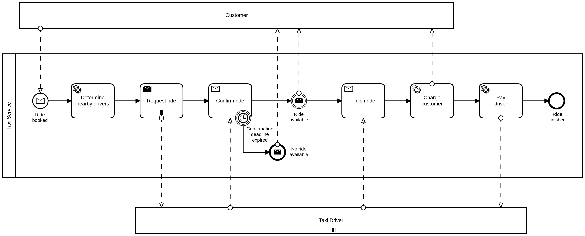

# Smallest possible Taxi Ride Blueprint sample

This is a code-sample which shows how the [Taxi Ride Blueprint SPI](https://github.com/phactum/taxiride-blueprint) simplifies building business processing applications.

Additionally, it highlights the differences to the [former approach](https://github.com/phactum-at/variable-less) since it implements the same reduced taxi process. This former approach has been used in past projects and has been presented at the talk *["How to Say Goodbye to Process Variables"](https://page.camunda.com/ccs2022-goodbyetoprocessvariables)* which was part of the [Camunda-Summit 2022](https://summit.camunda.com/expert-sessions/). Checkout the improvements-section underneath to get a brief summary of differences.

## Improvements

Using an aspect oriented programming (AOP) design of the SPI...

1. ...prevents domination of business code by the SPI.
1. ...hides the workflow system API (e.g. for easy upgrades from [Camunda 7](https://docs.camunda.org) to [Camunda 8](https://docs.camunda.io)).
1. ...keeps the business-code readable and maintainable.
1. ...enables validation of correct BPMN wiring at startup of the application.

## TaxiRide sample

The components of the sample:

* BPMN:
  [src/main/resources/processes/TaxiRide.bpmn](./src/main/resources/processes/TaxiRide.bpmn)
  
* Workflow-aggregate:
  [src/main/java/at/phactum/blueprint/taxiride/domain](./src/main/java/at/phactum/blueprint/taxiride/domain)
* BPMN tasks implementation:
  [src/main/java/at/phactum/blueprint/taxiride/TaxiRide.java](./src/main/java/at/phactum/blueprint/taxiride/TaxiRide.java)

*Hint:* This Maven project does not produce a runnable Spring Boot application but it runs a Spring Boot integration test to prove the functionality of the `TaxiRide` business bean. Use `mvn verify` to run the test.

*Hint:* This sample uses Camunda 7. If you run [a local installation of Camunda 8](https://docs.camunda.io/docs/self-managed/platform-deployment/docker/#docker-compose) then change Maven dependency `blueprint-camunda7-adapter` to `blueprint-camunda8-adapter` in `pom.xml` and adopt `@ActiveProfiles` in class `TaxiRideIT` from `"camunda7"` to `"camunda8"`.
